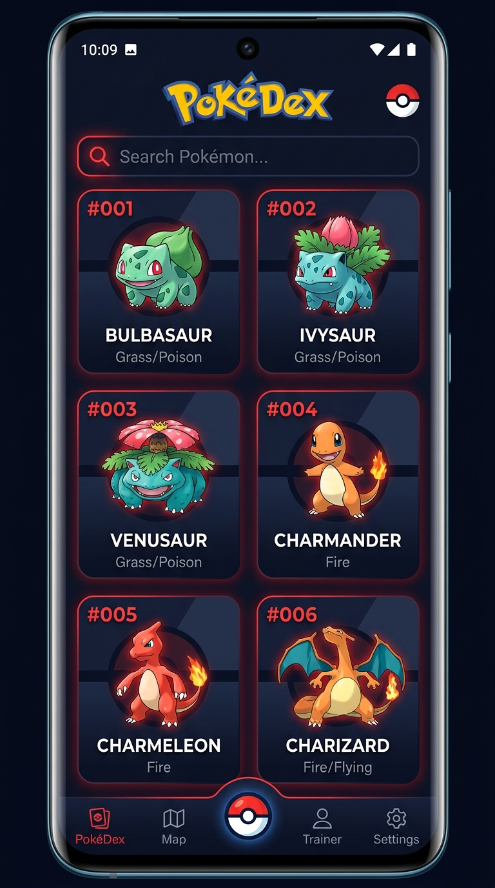
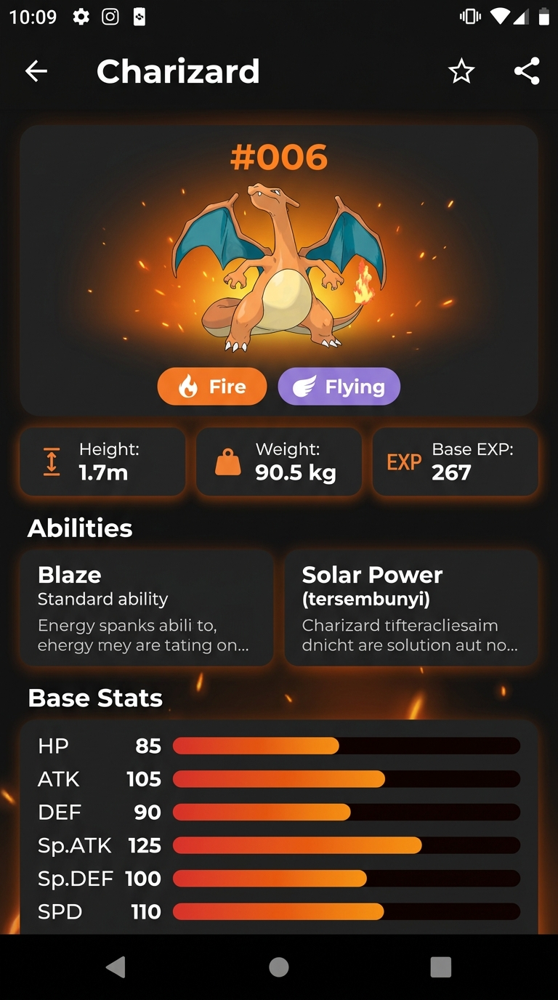
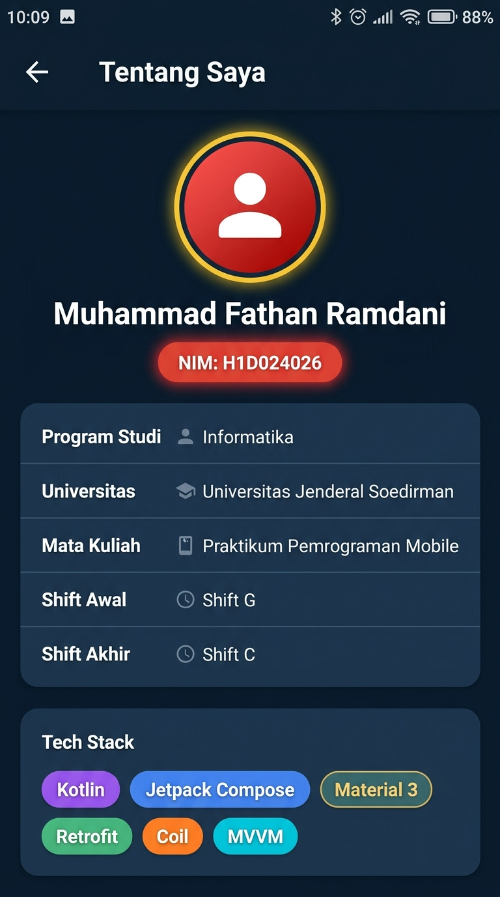

# PokéDex - Pokémon Explorer
> Aplikasi Android untuk menjelajahi dunia Pokémon dengan data real-time dari PokéAPI

---

## 👤 Identitas Praktikan
- **Nama Lengkap:** Muhammad Fathan Ramdani
- **NIM:** H1D024026
- **Shift Awal:** Shift G
- **Shift Akhir:** Shift C
- **Link Video Demo/Penjelasan:** [YouTube Demo](https://youtu.be/placeholder)

---

## 📱 Deskripsi Aplikasi

**PokéDex** adalah aplikasi Android modern yang memungkinkan pengguna untuk menjelajahi dan mempelajari informasi lengkap tentang berbagai Pokémon. Aplikasi ini mengambil data secara real-time dari [PokéAPI](https://pokeapi.co), sebuah RESTful API publik yang menyediakan data komprehensif tentang semua Pokémon.

**Masalah yang diselesaikan:** Pengguna yang ingin mengetahui informasi detail tentang Pokémon (stats, tipe, kemampuan, dll.) kini dapat mengaksesnya dengan mudah melalui antarmuka yang modern dan intuitif.

**Target pengguna:** Penggemar Pokémon dan mahasiswa yang belajar pengembangan aplikasi Android.

**Fitur Utama:**
- 🔍 **Pencarian real-time** - Cari Pokémon berdasarkan nama atau nomor
- 📜 **Daftar Pokémon** - Tampilan grid dengan infinite scroll (lazy loading)
- 📊 **Detail lengkap** - Stats, tipe, kemampuan, tinggi, berat, dan base experience
- 👤 **Halaman About** - Informasi identitas pengembang

---

## 🛠️ Penjelasan Teknis

### 1. Spesifikasi & Tech Stack
- **Bahasa:** Kotlin 2.0.21
- **UI Framework:** Jetpack Compose (Material 3)
- **Min SDK:** 26 (Android 8.0) | **Target SDK:** 35 (Android 15)
- **Pola Arsitektur:** MVVM (Model-View-ViewModel)
- **Library Utama:**
  - `Navigation Compose 2.8.5` (Routing halaman antar screen)
  - `ViewModel` & `StateFlow` (State Management reaktif)
  - `Retrofit 2.11.0` (HTTP client untuk REST API)
  - `OkHttp 4.12.0` (HTTP interceptor & logging)
  - `Coil 2.7.0` (Asynchronous image loading dari URL)
  - `Kotlin Coroutines 1.9.0` (Asynchronous processing)
  - `Gson 2.11.0` (JSON parsing/deserialization)

### 2. Fitur Utama

- **Home Screen (Daftar Pokémon):**
  - Menampilkan daftar Pokémon dalam bentuk grid 2 kolom
  - Setiap card menampilkan gambar, nomor Pokémon, dan nama
  - Infinite scroll (lazy loading) untuk memuat lebih banyak Pokémon saat di-scroll
  - Fitur pencarian real-time berdasarkan nama atau ID Pokémon
  - Loading state dengan circular progress indicator

- **Detail Screen (Detail Pokémon):**
  - Menampilkan gambar official artwork beresolusi tinggi
  - Informasi lengkap: ID, tipe, tinggi, berat, base experience
  - Daftar kemampuan (abilities) termasuk hidden abilities
  - Animated progress bar untuk 6 base stats (HP, ATK, DEF, Sp.ATK, Sp.DEF, SPD)
  - Warna UI dinamis menyesuaikan tipe Pokémon

- **About Screen:**
  - Halaman profil pengembang dengan identitas lengkap (Nama, NIM, Shift)
  - Informasi tech stack yang digunakan dalam pengembangan aplikasi

### 3. Struktur Direktori Proyek
```text
app/src/main/java/com/example/pokemonapp/
├── data/
│   ├── model/          # Data class: PokemonListResponse, PokemonDetail, dll.
│   ├── remote/         # PokemonApiService (Retrofit interface), RetrofitInstance
│   └── repository/     # PokemonRepository (abstraksi akses data + sealed Result)
├── ui/
│   ├── navigation/     # Screen.kt (routes), PokemonNavGraph.kt
│   ├── screens/
│   │   ├── home/       # HomeScreen.kt + HomeViewModel.kt
│   │   ├── detail/     # DetailScreen.kt + DetailViewModel.kt
│   │   └── about/      # AboutScreen.kt
│   └── theme/          # Color.kt, Type.kt, Theme.kt (Material 3 dark theme)
└── MainActivity.kt
```

### 4. Alur Data (Data Flow)
```
PokéAPI (https://pokeapi.co/api/v2/)
    ↓ HTTP Request (Retrofit + OkHttp)
PokemonApiService (Interface)
    ↓ Suspend Function (Coroutines)
PokemonRepository (Business Logic + Error Handling)
    ↓ Result<T> (Success/Error)
ViewModel (StateFlow<UiState>)
    ↓ collectAsState()
Composable Screen (Recompose on state change)
```

---

## 📸 Tangkapan Layar (Screenshots)

| Home Screen | Detail Screen | About Screen |
|:---:|:---:|:---:|
|  |  |  |

---

## 🚀 Cara Menjalankan Proyek

1. **Prasyarat:**
   - Android Studio (Ladybug / versi terbaru disarankan).
   - JDK 17 atau lebih baru.
   - Perangkat fisik Android (API 26+) dengan USB Debugging aktif atau Android Emulator.
   - Koneksi internet aktif (untuk mengambil data dari PokéAPI).

2. **Langkah:**
   ```bash
   # Clone repository
   git clone https://github.com/MFathanrmd/H1D024026-ResponsiPEMOB.git
   ```
3. Buka folder proyek di **Android Studio**.
4. Tunggu proses **Gradle Sync** selesai (membutuhkan koneksi internet).
5. Pilih target perangkat/emulator, lalu klik tombol **Run (`Shift + F10`)**.

---

## 📡 API Reference

Aplikasi ini menggunakan **PokéAPI v2** (https://pokeapi.co/api/v2/):

| Endpoint | Deskripsi |
|---|---|
| `GET /pokemon?limit={n}&offset={m}` | Mengambil daftar Pokémon dengan pagination |
| `GET /pokemon/{name_or_id}` | Mengambil detail lengkap satu Pokémon |

---

## 📁 Struktur Repository

```
H1D024026-ResponsiPEMOB/
├── app/
│   ├── src/main/
│   │   ├── java/com/example/pokemonapp/   # Source code Kotlin
│   │   ├── res/                           # Resources (drawable, values, dll.)
│   │   └── AndroidManifest.xml
│   └── build.gradle.kts
├── docs/
│   ├── screen1.jpg    # Screenshot Home Screen
│   ├── screen2.jpg    # Screenshot Detail Screen
│   └── screen3.jpg    # Screenshot About Screen
├── gradle/
│   └── libs.versions.toml
├── build.gradle.kts
├── settings.gradle.kts
└── README.md
```

---

*Dibuat sebagai tugas Responsi Praktikum Pemrograman Mobile*
*Universitas Jenderal Soedirman - Program Studi Informatika*
